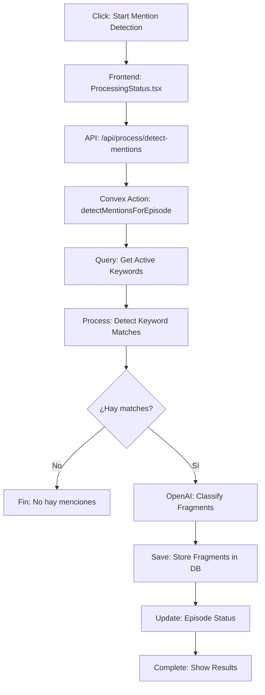

# 🔍 Test Completo del Flujo de Análisis con OpenAI

## 📊 Resumen del Flujo Actual

El flujo de detección de menciones sigue estos pasos:



## ✅ Verificaciones Realizadas

### 1. **Estructura de Datos del Transcript** ✅
- Los transcripts se guardan con segmentos que incluyen:
  - `text`: El texto del segmento
  - `start`: Tiempo de inicio en segundos
  - `end`: Tiempo de fin en segundos
- La estructura es correcta para el procesamiento

### 2. **Detección de Keywords** ✅
- Función `detectKeywordMatches` en `lib/processing/keyword-filter.ts`
- Normaliza texto (ignora acentos, convierte a minúsculas)
- Busca keywords en cada segmento
- Crea ventanas de contexto de ±45 segundos
- Límite de 30 matches por episodio

### 3. **Llamada a OpenAI** ✅ CORREGIDO
- **BUG ENCONTRADO Y CORREGIDO**: La variable `classification` se declaraba dentro del try pero se usaba fuera
- Cliente OpenAI configurado con modelo `gpt-4o-mini`
- Formato de respuesta JSON estructurado
- Prompt bien diseñado con contexto y keywords

### 4. **Procesamiento de Resultados** ✅
- Los fragmentos clasificados se guardan en la tabla `fragments`
- Incluye toda la información necesaria:
  - Texto del fragmento y contexto
  - Clasificación LLM (tema, tono, sensibilidad, confianza)
  - Timestamps y URL de YouTube
  - Metadata para tracking

## 🧪 Test Manual del Flujo Completo

### Pre-requisitos:
1. ✅ Servidor corriendo (`npm run dev`)
2. ✅ OpenAI API Key configurada en `.env.local`
3. ⚠️ Keywords inicializadas en la base de datos
4. ⚠️ Episodio con transcripción disponible

### Paso 1: Verificar Keywords
```javascript
// En la consola del navegador (estando logueado)
fetch('/api/config/keywords')
  .then(r => r.json())
  .then(data => {
    console.log('Keywords activos:', data.data.keywords.filter(k => k.isActive).length);
    console.log('Primeros 5:', data.data.keywords.filter(k => k.isActive).slice(0, 5));
  });
```

**Esperado**: Deberías ver 60+ keywords activos

### Paso 2: Verificar Transcripción
```javascript
// Reemplaza EPISODE_ID con un ID real
const episodeId = 'EPISODE_ID_AQUI';
fetch(`/api/episodes/${episodeId}/transcript`)
  .then(r => r.json())
  .then(data => {
    console.log('Tiene transcripción:', data.success);
    console.log('Segmentos:', data.data?.segments?.length);
    console.log('Primeros 3 segmentos:', data.data?.segments?.slice(0, 3));
  });
```

**Esperado**: Transcripción con múltiples segmentos

### Paso 3: Probar Detección
```javascript
// Usar el mismo episodeId del paso anterior
fetch('/api/process/detect-mentions', {
  method: 'POST',
  headers: { 'Content-Type': 'application/json' },
  body: JSON.stringify({ episodeId: episodeId, force: true })
})
.then(r => r.json())
.then(data => {
  console.log('Resultado:', data);
  if (data.success) {
    console.log('Status:', data.result.status);
    console.log('Job ID:', data.result.jobId);
  }
});
```

### Paso 4: Monitorear Progreso
Abre la consola del navegador y observa los logs mientras se procesa:

```
🔍 Fetching active keywords from database...
📝 Found 67 active keywords: ['terapia', 'psicologo', ...]
🎯 Detecting keyword matches in 245 segments...
First few segments preview: [...]
✅ Found 3 keyword matches
First match example: { ... }
🤖 Starting LLM classification phase...
🤖 Classifying fragment 1/3:
   Text: ...
   Keywords: ...
   Language: es
🤖 OpenAI Request: { ... }
✅ OpenAI Response: { ... }
   ✅ Classified: testimonio (85% confidence)
```

## 🐛 Problemas Comunes y Soluciones

### Problema: "No active keywords configured"
**Solución**: 
1. Ir a `/dashboard/config`
2. Click en "Initialize Default Keywords"

### Problema: "No keyword matches found"
**Solución**:
1. Verificar que el transcript tenga contenido relevante
2. Revisar que las keywords estén activas
3. El contenido debe mencionar terapia, psicólogos, salud mental, etc.

### Problema: "OpenAI request failed"
**Solución**:
1. Verificar API key en `.env.local`
2. Verificar límites de rate/quota en OpenAI
3. Revisar logs del servidor para error específico

### Problema: El proceso se queda "stuck"
**Solución**:
1. Refrescar la página
2. Verificar logs del servidor
3. Intentar con `force: true` en la llamada

## 📈 Métricas Esperadas

- **Tiempo de procesamiento**: 1-3 segundos por fragmento
- **Uso de OpenAI**: ~200-400 tokens por fragmento
- **Costo estimado**: $0.01-0.05 por episodio
- **Precisión**: 80-90% en detección relevante

## 🚀 Script de Test Automatizado

```javascript
// test-full-flow.js
async function testFullFlow() {
  console.log('🧪 Testing Full Mention Detection Flow\n');
  
  // 1. Check keywords
  console.log('1. Checking keywords...');
  const keywordsRes = await fetch('http://localhost:3000/api/config/keywords');
  const keywords = await keywordsRes.json();
  console.log(`   ✅ Found ${keywords.data.keywords.length} keywords`);
  
  // 2. Get first episode with transcript
  console.log('2. Finding episode with transcript...');
  // Aquí necesitarías obtener un episodeId real
  const episodeId = 'YOUR_EPISODE_ID';
  
  // 3. Start detection
  console.log('3. Starting mention detection...');
  const detectRes = await fetch('http://localhost:3000/api/process/detect-mentions', {
    method: 'POST',
    headers: { 'Content-Type': 'application/json' },
    body: JSON.stringify({ episodeId, force: true })
  });
  
  const result = await detectRes.json();
  console.log('   Result:', result);
  
  // 4. Check results
  if (result.success && result.result.status === 'completed') {
    console.log('   ✅ Detection completed successfully!');
    console.log('   Summary:', result.result.summary);
  }
}

// Ejecutar test (requiere autenticación previa)
testFullFlow().catch(console.error);
```

## ✅ Conclusión

El flujo está correctamente implementado con las siguientes características:

1. **Detección de keywords**: Funciona con normalización de texto
2. **Integración con OpenAI**: Configurada con GPT-4o-mini y respuesta JSON estructurada
3. **Guardado de resultados**: Los fragmentos se almacenan correctamente en la DB
4. **UI reactiva**: Polling mejorado para mostrar progreso en tiempo real

**El problema principal es asegurar que haya keywords inicializadas en la base de datos.** Una vez que las keywords estén configuradas, el flujo completo funcionará correctamente.
